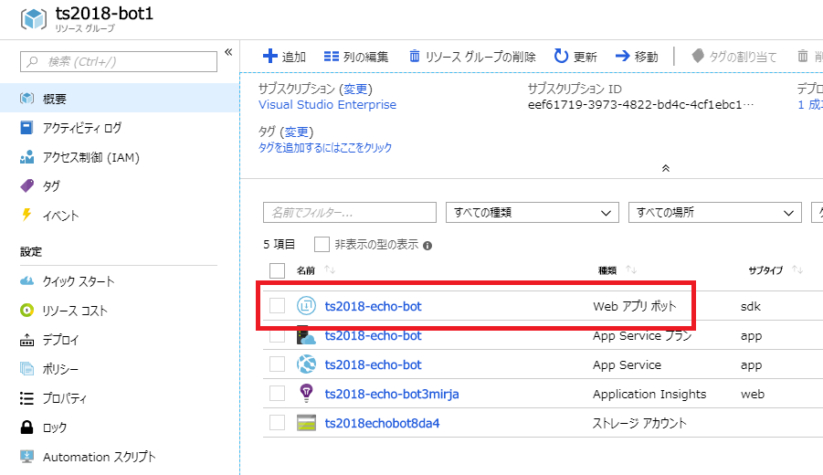

# 01-01. Bot Service (Web App Bot) の作成

## ハンズオンの流れ

以下の流れでハンズオンを進めます。

- Azure ポータルから Bot Service(Web App Bot) を作成
- Web チャットによる動作確認

> # TODO: 全体の流れ追記！！！！！！！！！！

## Bot Service とは

Azure Bot Service は、インテリジェントなボットの作成、テスト、配置、管理をすべて一元的に行うツールが備わっているサービスです。Skype, Microsoft Teams, Slack, Facebook Messenger などの Channel に容易に接続できる機能も備えています。  
Azure Bot Service のひとつ、**Web App Bot** は、Azure App Service の Web Apps 上にボットアプリケーションをホストするサービスです。

Azure ポータルで、Bot Service (Web App Bot) を作成から始めましょう。

## Bot Service (Web App Bot) の作成

[Azure のポータル: https://portal.azure.com/](https://portal.azure.com/) にアクセスします。

左上の 「リソースの作成」> 検索で「web app bot」と入力して Enter キーを押します。

&nbsp;

「Web App Bot」が表示されますのでクリック > 「作成」をクリックします。

&nbsp;

リソースの作成に必要な値を入力します。入力例は以下です。

| 項目               | 説明                                             | 値（例）           |
| ------------------ | ------------------------------------------------ | ------------------ |
| ボット名           | 一意になるような任意の値を入力します。           | `ts2018-ehcho-bot` |
| サブスクリプション | 利用可能なサブスクリプションを選択します。       |                    |
| リソースグループ   | 「新規作成」をクリックし、任意の値を入力します。 | `ts2018-bot1`      |
| 場所               | WebApps を配置する場所を任意に選びます。         | `Japan West`       |
| 価格レベル         | 無料プラン（F0）を選びます。                     | `F0`               |
| アプリ名           | 一意になる任意の値を選びます。                   | `ts2018-bot1`      |

&nbsp;

引き続き値を入力します。  
「ボットテンプレート」をクリックし、テンプレートの選択を行います。  
入力が完了したら画面下部の「選択」ボタンをクリックし、ボットテンプレートの表示が「Echo Bot (C#)」になっていることを確認しましょう。

| 項目           | 説明                    | 値                    |
| -------------- | ----------------------- | --------------------- |
| SDK バージョン | SDK v4 を選択します。   | `SDK v4 (プレビュー)` |
| SDK 言語       | C#を選択します。        | `C#`                  |
| テンプレート   | Echo Bot を選択します。 | `Echo Bot`            |

&nbsp;

引き続き値を入力します。  
「App Service プラン/場所」をクリックし、Web アプリのプランを選択します。  
既存で作成されている App Service プランがある場合、選択して構いません。
新規に作成したい場合は、「新規作成」をクリックし、任意に値を入力して作成ます。

> **Note:** App Service プランを新規に作成すると、デフォルトで高機能な有料のプランが選択されます。このリソースを作成後、無料プランに変更することが可能です。

&nbsp;

以降の項目（「Azure Storage」「Application Insights」「Mmicrosoft アプリ ID とパスワード」）はデフォルトのままで構いません。
全て入力したら「作成」ボタンをクリックします。リソースのデプロイメントを開始されます。

数分でデプロイメントが完了します。

## 動作確認

デプロイメントされたリソースを確認し、Web チャットで動作確認してみましょう。

### App Service プランの確認

動作確認の前に、App Service プラン を確認しましょう。  
画面左側のメニューで「リソースグループ」をクリックし、先ほど作成したリソースグループに移動すると、種類「App Service プラン」のリソースがあります。クリックしましょう。

> **Note:** 新規作成せず、既存の App Service プランを選択した場合、同一のリソースグループにない可能性があります。その場合、この手順を飛ばして問題ありません。

&nbsp;

「スケールアップ」をクリック > 「開発/テスト」タブをクリック > 「F1」（無料プラン）をクリックします。  
画面下の「適用」ボタンをクリックして適用します。

&nbsp;

### Web チャットによる動作確認

Web App Bot を開きましょう。画面左側のメニューで「リソースグループ」をクリックし、先ほど作成したリソースグループに移動します。  
リソースグループで、「Web アプリ ボット」をクリックします。

&nbsp;

「Web チャットでテスト」をクリックすると、Web チャットが表示されます。メッセージを入力してみましょう。エコーが返ってきます。  
これは、このリソースを作った時に、エコーを表示するサンプルプログラムがデプロイされるためです。

> **Memo**:「conversationUpdate event detected」というメッセージが表示されますが、これもサンプルプログラムに実装された正常な動作となります。

&nbsp;

## このチャプターのまとめ

ここまでで、以下のことができました。

- Azure 上にエコーをするチャットボットの作成
- Azure ポータルから Web チャットによる動作の確認

次は、Azure 上にデプロイされたプログラムをダウンロードし、プログラムに変更を加えて、Azure 上へ再デプロイしてみましょう。

---

[README に戻る](../../../README.md) | [次へ進む](./01-02_edit-program.md)

&nbsp;

---

## 参考

※ 2018 年 11 月現在だと、V4 の公式ドキュメントの一部は日本語翻訳対応が追い付いていないため、英語のドキュメントを見る必要があります。

- [About Azure Bot Service](https://docs.microsoft.com/en-us/azure/bot-service/bot-service-overview-introduction?view=azure-bot-service-4.0)
