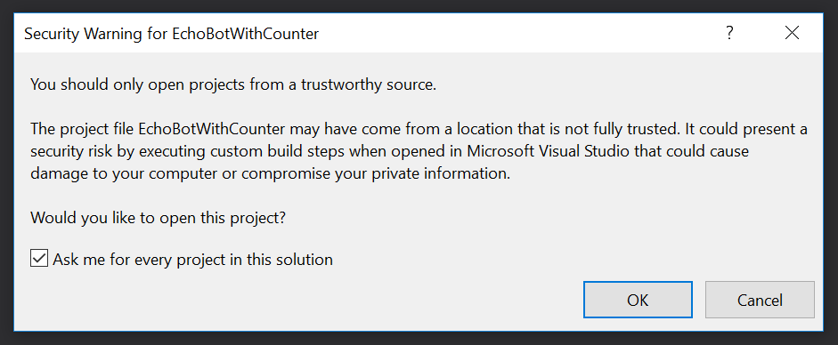
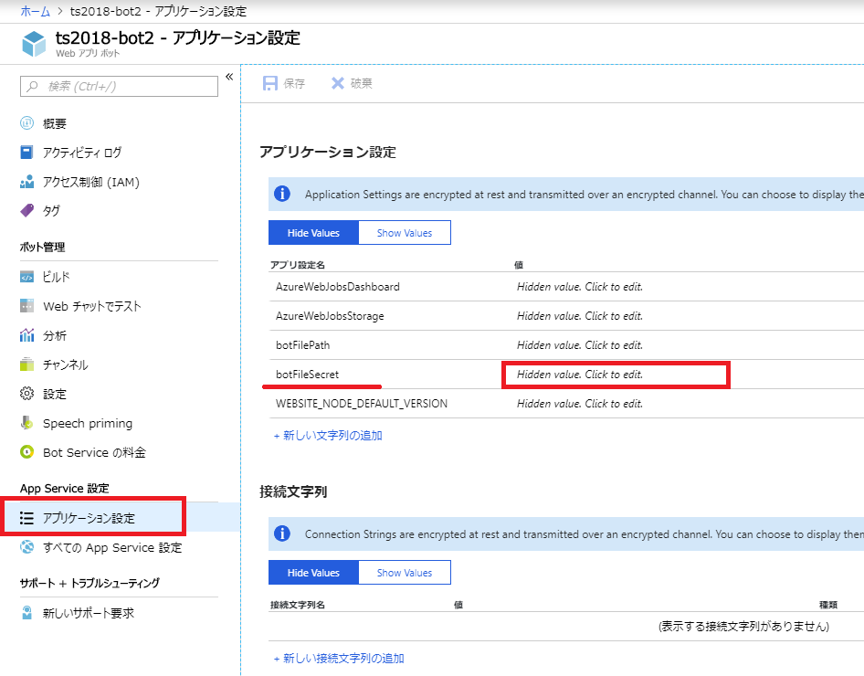
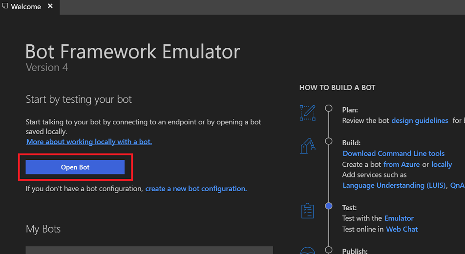
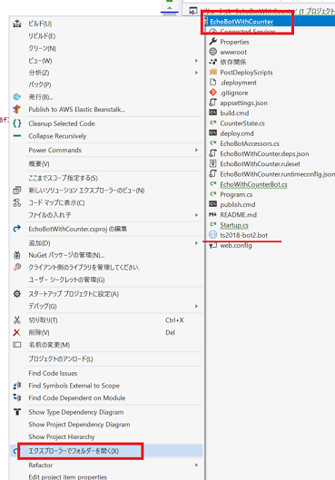
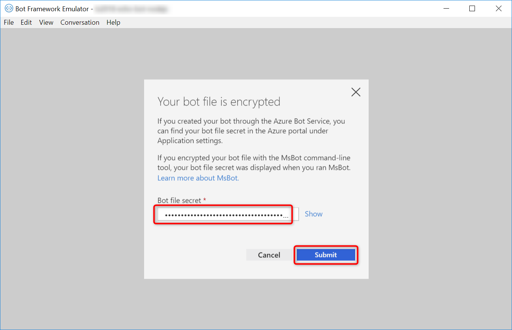

# 01-02. プログラムの変更とデプロイ

Azure 上にデプロイされた Bot Service (Web App Bot) のソースコードをダウンロードし、更新して再度デプロイしてみましょう。

## ソースコードのダウンロード

Azure ポータルで、今回作成したリソースグループを開き、種類が「Web アプリ ボット」のリソースをクリックし、Web App Bot を開きます。


&nbsp;

「ビルド」をクリック > 「zip ファイルをダウンロード」をクリックします。  
ソース Zip ファイルの作成中と表示され、準備が終わる（1 分程度かかります）と「zip ファイルをダウンロード」ボタンが表示されます。クリックしてダウンロードしましょう。


&nbsp;

ダウンロードされた Zip ファイルを解凍しましょう。

## ソースコードの編集

Zip ファイルを解凍すると、中にソリューションファイル（拡張子が `.sln` のファイル）があります。ダブルクリックすると、Visual Studio でプロジェクトが表示されます。

Visual Studio は、ソリューションファイルがダウンロードしたものであると判断すると、安全性の確認をもとめてくる場合があります。もし下記のような警告が表示される場合は、確認の上、「OK」をクリックして進めてください。



ソリューションエクスプローラーで「EchoWithCounterBot.cs」をダブルクリックして開きましょう。  
ここで詳細の説明はしませんが、ユーザーがチャットボットにアクセスすると、`EchoWithCounterBot` クラスの `OnTurnAsync` が実行されます。

### 簡単な分岐の実装

ユーザーが特定のことばを入力した場合、チャットボットが特定のメッセージを返す動作を作ってみましょう。

ここでは、「**ヘルプ**」と入力すると、「**私は、エコーを返すチャットボットです。何か入力してください。**」と返すようにします。

実装は以下コードにあるように、 `OnTurnAsync` の `if (turnContext.Activity.Type == ActivityTypes.Message)` if ステートメント内を変更します。
この中にあった既存のコードは、新たに追加した `if (message == "ヘルプ"){...} else {...}` の `else` の ステートメントブロックに移動します。

次に、`if (message == "ヘルプ")` の前の行で、ユーザーが入力したメッセージを取得しています。

最後に、`if (message == "ヘルプ")` の中に新規コードを追加しています。

```cs
        public async Task OnTurnAsync(ITurnContext turnContext, CancellationToken cancellationToken = default(CancellationToken))
        {
            // Handle Message activity type, which is the main activity type for shown within a conversational interface
            // Message activities may contain text, speech, interactive cards, and binary or unknown attachments.
            // see https://aka.ms/about-bot-activity-message to learn more about the message and other activity types
            if (turnContext.Activity.Type == ActivityTypes.Message)
            {
                // ★: ここから ----
                var receivedMessage = turnContext.Activity.Text;

                // ★: 「ヘルプ」と入力された場合の条件を追加する
                if (receivedMessage == "ヘルプ")
                {
                    var helpMessage = "私は、エコーを返すチャットボットです。何か入力してください。";
                    await turnContext.SendActivityAsync(helpMessage);
                }
                // ★: その他の条件の場合、元の処理を実行する
                else
                {
                    // Get the conversation state from the turn context.
                    var state = await _accessors.CounterState.GetAsync(turnContext, () => new CounterState());

                    // Bump the turn count for this conversation.
                    state.TurnCount++;

                    // Set the property using the accessor.
                    await _accessors.CounterState.SetAsync(turnContext, state);

                    // Save the new turn count into the conversation state.
                    await _accessors.ConversationState.SaveChangesAsync(turnContext);

                    // Echo back to the user whatever they typed.
                    var responseMessage = $"Turn {state.TurnCount}: You sent '{turnContext.Activity.Text}'\n";
                    await turnContext.SendActivityAsync(responseMessage);
                }
                // ★: ここまで ----
            }
            else
            {
                await turnContext.SendActivityAsync($"{turnContext.Activity.Type} event detected");
            }
        }
```

※ 保存するときに、2バイト文字列を含む更新を行ったので、下記の警告が表示される場合があります。「Yes」ボタンをクリックし進めてください。


## ローカルでデバッグ

本ハンズオンでは、PC に、ローカルでデバッグ実行してテストできるよう、チャットボットのクライアントアプリ（ユーザーがことばを入力する UI のアプリ)として、Bot Framework Emulator がインストール済みになっています。
ソースコードをデバッグし、Bot Framework Emulator から起動して動作確認してみましょう。

### 準備

Azure Bot Service からダウンロードしたソースコードをデバッグするには、2 つの作業が必要になります。

- Azure ポータルから暗号キーの取得し、ソースコードにセットする
- `.bot` ファイルのファイル名を確認し、設定する

&nbsp;

#### Azure ポータルからシークレットキーの取得し、ソースコードにセット

ソリューションエクスプローラー内にある `.bot` は暗号化されているためシークレットキーが必要になります。Azure ポータルの、Bot Service のアプリケーション設定に登録されています。

Azure ポータルで、Web App Bot のリソースを開きましょう。

> 開き方が不明の場合: 今回作成したリソースグループを開き、種類が「Web アプリ ボット」のリソースをクリックして開きます。

「アプリケーション設定」をクリックします。表示された画面を下へスクロールし、「アプリケーション設定」の中から botFileSecret の値を取得しましょう。



&nbsp;

Visual Studio に戻り、`Startup.cs` を開きます。  
`ConfigureServices` メソッドで、

```cs
var secretKey = Configuration.GetSection("botFileSecret")?.Value;
```

と書かれた部分を、以下のように変更します。

```cs
var secretKey = Configuration.GetSection("botFileSecret")?.Value ?? "{先ほど取得したシークレットキー}";
```

> 注意: 今回は簡易に実装するためシークレットキーを直接記載していますが、一般的には、セキュアな方法で実装します。

&nbsp;

#### `.bot` ファイルの設定

引き続き `Startup.cs` の `ConfigureServices` メソッドを見ていきます。

70 行目あたりのコードで、.bot のファイル名を指定しています。  
このファイル名をソリューションエクスプローラーでファイル名を確認し、実際に存在するファイル名に変更します。

```cs
try
{
    // ソリューションエクスプローラーで、「ts2018-bot2.bot」がある場合は、以下のように変更します。
    botConfig = BotConfiguration.Load(botFilePath ?? @".\ts2018-bot2.bot", secretKey);
}
```

&nbsp;

### ブレークポイントの確認

なお、 `Startup.cs` には、２つのブレークポイントが設定されているので、必要がない場合は外しましょう。


&nbsp;

### デバッグ実行

それでは、`F5` キーを押してデバッグ実行を開始し、エラーなく実行できることを確認しましょう。

&nbsp;

### エミュレーターの起動

Windows のメニューで「bot」と入力し、Bot Framework Emulator を起動します。


&nbsp;

「Open Bot」をクリックし、`.bot` ファイルを選択しましょう。



&nbsp;

`.bot` ファイルの場所が不明の場合は、Visual Studio でプロジェクト名を右クリックし、「エクスプローラーでフォルダーを開く」をクリックして確認することができます。



&nbsp;

下記のように _Bot file secret_ を求められた場合は、先ほど取得した `botFileSecret` のシークレットキーの値を入力し、「Submit」ボタンをクリックして進んでください。



&nbsp;

「ヘルプ」と入力し、実装した動作になることを確認してみましょう。


&nbsp;

### デバッグ実行の停止

確認が済んだら、 Visual Studio で `Shift + F5` を入力し、デバッグ実行を停止します。

&nbsp;

## 発行（デプロイ）

今回のようにダウンロードしたプログラムには、既に Azure への発行情報が組み込まれていますが、発行をするためのパスワードだけは、確認して入力する必要があります。

### 発行プロファイルの取得

Web Apps（App Service）に対して発行を行う前に、Web Apps のリソースから発行プロファイルを取得し、パスワードを取得をします。

Azure のポータルを開きましょう。今回作成した App Service のリソースを開きます。

> 開き方が不明の場合: 今回作成したリソースグループを開き、種類が「App Service」のリソースをクリックして開きます。


&nbsp;

メニューの「概要」 > 「発行プロファイルの取得」をクリックすると、発行プロファイルがダウンロードされます。


&nbsp;

発行プロファイルは、XML ファイルになっています。テキストエディター（メモ帳や VS Code）で開きましょう。  
改行がないため見難いですが、「publishProfile profileName="ts2018-echo-bot - Web Deploy"」の中の「userPWD」の値がパスワードになります。
この後の手順で利用します。


&nbsp;

### 発行（デプロイ）の実施

更新したプログラムを Azure 上にデプロイしてみましょう。

ここでは、Visual Studio の GUI から発行を行います。  
今回は説明しませんが、Azure CLI を使った発行や、継続的なデプロイの設定も可能です。

先ほどまで作業していた Visual Studio に戻り、ソリューションエクスプローラーでプロジェクト名を右クリック > 「発行」をクリックします。


&nbsp;

発行の画面が表示されます。「構成」をクリックします。


&nbsp;

発行のダイアログが表示されます。パスワードに先ほど取得したパスワードを入力しましょう。  
「接続の検証」ボタンをクリックすると、接続テストを行ってパスワードが正しいか確認できます。  
正常に検証ができたら、「保存」ボタンをクリックしましょう。


&nbsp;

発行の画面に戻ったら、「発行」ボタンをクリックし、発行を行います。


&nbsp;

出力ウインドウで、発行の進捗が確認できます。以下のように表示されたら完了です。


&nbsp;

## WebChat で動作確認

Web Chat の機能で、更新したプログラムが正しく動作するか確認しましょう。  
Azure ポータルで、Bot Service のリソースを開きましょう。

> 開き方が不明の場合: 今回作成したリソースグループを開き、種類が「Web アプリ ボット」のリソースをクリックして開きます。


&nbsp;

「Web チャットでテスト」を開きます。「ヘルプ」と入力して実装した内容が返されれば、正常に更新ができました。


&nbsp;

## このチャプターのまとめ

ここまでで、以下のことができました。

- Azure 上にデプロイされたソースコードのダウンロード
- ソースコードの編集
- 編集したソースコードを GUI で発行（デプロイ）

次は、Slack や Microsoft Teams といったチャンネルに接続してみます。

---

[前に戻る](./01-01_create-webapp-bot.md) | [次へ進む](./01-03_connect-to-channels.md)

---

### 参考ドキュメント

※ 2018 年 11 月現在だと、V4 の公式ドキュメントの一部は日本語翻訳対応が追い付いていないため、英語のドキュメントを見る必要があります。

- [Understanding how bots work](https://docs.microsoft.com/en-us/azure/bot-service/bot-builder-basics?view=azure-bot-service-4.0&tabs=cs)
- [Download and redeploy bot code](https://docs.microsoft.com/en-us/azure/bot-service/bot-service-build-download-source-code?view=azure-bot-service-4.0)
- [Set up continuous deployment](https://docs.microsoft.com/en-us/azure/bot-service/bot-service-build-continuous-deployment?view=azure-bot-service-4.0)
