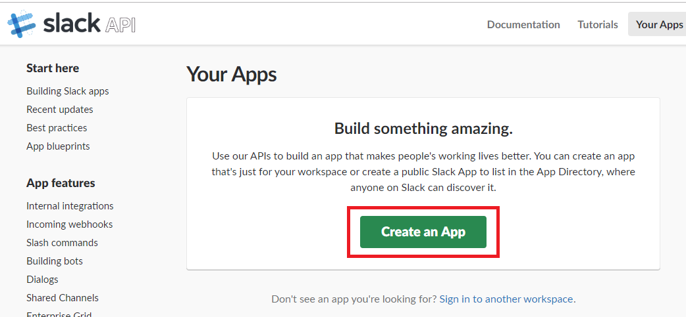
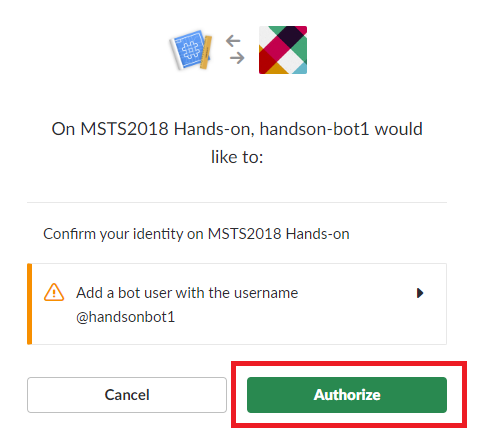

# 01-03. チャンネルに接続

Bot Service の強力な機能のひとつとして、容易に様々なチャンネル（Skype や Facebook、Twilio など）に接続が可能な点があります。  
プログラムは変更不要で様々なサービスに接続できます。  
ここでは、以下の 2 つのサービスに接続して会話ができることを試します。

- Microsoft Teams
- Slack

## Microsoft Teams に接続

利用可能な Microsoft Teams のアカウントをお持ちの場合は、ご自身のをご利用ください。

また、ハンズオン用に用意してあるアカウントがあります。ご利用の場合は、ハンズオン用PCにプリインストールされている Microsoft Teams をご利用ください。

### Teams チャンネルの有効化

Azure ポータルを開き、今回作成した Bot Service のリソースを開きます。

> 開き方が不明の場合: 今回作成したリソースグループを開き、種類が「Web アプリ ボット」のリソースをクリックして開きます。

&nbsp;

「チャンネル」をクリックし、「チャンネルに接続」で、Teams のアイコンをクリックします。

&nbsp;

「保存」ボタンをクリックします。

> **Note**: 認証を使った機能の実装も可能ですが、今回は利用しません。

&nbsp;

「サービス条件」の確認が表示される場合は、確認の上、同意にチェックを付け、「Agree」ボタンをクリックしてください。

&nbsp;

### ID の取得

「Microsoft App ID」を取得します。これは、Teams から Bot Service に接続する際に必要となります。  
Bot Service のリソースの「設定」をクリックすると、「Microsoft App ID」の値が表示されます。後程利用しますので、コピーしておきましょう。（フィールドをダブルクリックすると選択できます。）

&nbsp;

### Teams から接続

Microsoft Teams を開きましょう。  
Teams のメニュー「チャット」を右クリック > 「新しいチャット」をクリックします。

&nbsp;

メンバーの入力欄に、先ほど Azure ポータルで取得した「Microsoft App ID」の値を入力しましょう。ボットの表示名が表示されます。

&nbsp;

会話をしてみましょう。今回作成したエコーボットの返答が来ることが確認できます。

&nbsp;

## Slack に接続

この作業では、Slack にログインが必要です。Slack で自身のアカウントでお試し可能な場合は、お試しください。  
Slack のアカウントがない場合、以下の Slack のワークスペースで利用可能です。アカウント情報は、ハンズオンスタッフにお声がけください。

Slack と接続する際は、Slack で アプリケーションの登録して、Bot Service で資格情報を入力して接続する流れになります。

### Slack:アプリケーションの作成

Slack にログインした状態で、以下 URL にアクセスします。`Create an App` ボタンをクリックします。

`https://api.slack.com/apps`

&nbsp;

Bot User の登録画面で、「App Name」と「Developement Slack Workspace」に任意の値を入力します。  
ハンズオンスタッフからアカウントをもらった場合、「MSTS2018 Hands-on」を選択します。

「Create App」ボタンをクリックします。

&nbsp;

### Slack: リダイレクトの URL を登録

画面左部メニューの「OAuth & Permissions」をクリック > 「Add New Redirect URL」をクリックします。

&nbsp;

URL の入力欄が表示されますので、以下の値を入力します。

`https://slack.botframework.com`

「Add」ボタンをクリックし、そのあと「Save URLs」ボタンをクリックします。

&nbsp;

### Slack: Bot Users の登録

画面左部メニューの「Bot Users」をクリックし、「Add a Bot User」をクリックします。

&nbsp;

「Display name」「Default username」に任意の値を入力します。  
「Alwasy Show My Bot as Online」（このボットを常にオンラインにする）は、「On」にします。

「Add Bot User」をクリックします。

&nbsp;

### "BotHandle" の値を取得

Azure のポータルで情報の取得が必要です。  
Slack の画面は開いたまま、別のブラウザーウインドウで Azure ポータルを開き、作成したリソースグループから種類が「Web アプリ ボット」のリソースを開きます。

&nbsp;

「設定」をクリックし、「ボット ハンドル」の値をコピーしておきましょう。この後利用します。

また、Azure ポータル画面は開いたままにしましょう。後ほど戻ってきます。

&nbsp;

### Slack: Event Subscriptions の設定

Slack の画面に戻り設定を続けます。  
画面左部メニューの「Event Subscriptions」をクリックし、以下のように設定します。入力が完了したら「Save Changes」ボタンをクリックします。

| 項目                    | 説明                                                                           | 入力値                                                                                                                                 |
| ----------------------- | ------------------------------------------------------------------------------ | -------------------------------------------------------------------------------------------------------------------------------------- |
| Enable Events            | On にします。                                                                  | `On`                                                                                                                                   |
| Request URL             | 「`{YourBotHandle}`」には、先ほど取得した「ボット ハンドル」の値を入力します。 | `https://slack.botframework.com/api/Events/{YourBotHandle}`                                                                            |
| Subscribe to Bot Events | 「Add Bot User Event」ボタンをクリックし、6 つのイべントを追加します。         | `member_joined_channel`   `member_left_channel`   `message.channels`   `message.groups`   `message.im`   `message.mpim` |

&nbsp;

### Slack: 資格情報を取得

Slack の資格情報を取得します。

画面左部メニューの「Event Subscriptions」をクリックすると、「App Credentials」から下へスクロールすると各種値が記載されています。  
この画面を開いたままで、Azure ポータルに戻ります。

&nbsp;

### Bot Service で Slack の資格情報を登録

先ほど開いたままの Azure ポータル に戻りましょう。Bot Service(Web App Bot) のリソースで「チャンネル」をクリックします。  
「チャンネルに接続」画面の「その他のチャンネル」で、Slack の表示がありますのでクリックしましょう。

&nbsp;

3 つの資格情報を、Slack の資格情報の画面から取得して入力します。

| Azure ポータルの項目名   | Slack から取得する値 |
| ------------------------ | -------------------- |
| クライアント ID          | Client ID            |
| クライアントシークレット | Client Secret        |
| 確認トークン             | Verification Token   |

「保存」ボタンをクリックすると、以下の画面が表示されます。問題ないことを確認し「Authorize」ボタンをクリックします。

&nbsp;

正常に完了すると、Slack の App に先ほど作成したアプリが登録されたことが確認できます。  
Slack を開いてみましょう。登録したアプリを選択してメッセージを入力すると、Bot Service のチャットボットから応答が来ることが確認できます。

&nbsp;

> **Note**: より詳しい情報は、ページ下部に記載の公式ドキュメントから確認できます。

&nbsp;

## このチャプターのまとめ

ここでは、プログラムを変更せずにチャンネルに接続する方法を操作しました。

- Bot Service を Microsoft Teams に接続して会話
- Bot Service を Slack に接続して会話

ハンズオンはここまでとなります。次は、作成したリソースをクリーンアップします。

---

[前に戻る](./01-02_edit-program.md) | [次へ進む](./01-04_cleanup.md)

---

## 参考

※ 2018 年 11 月現在だと、V4 の公式ドキュメントの一部は日本語翻訳対応が追い付いていないため、英語のドキュメントを見る必要があります。

- [Connect a bot to channels](https://docs.microsoft.com/en-us/azure/bot-service/bot-service-manage-channels?view=azure-bot-service-4.0)
- [ボットを Slack に接続する](https://docs.microsoft.com/ja-jp/azure/bot-service/bot-service-channel-connect-slack?view=azure-bot-service-4.0)
- [Add bots to Microsoft Teams apps](https://docs.microsoft.com/ja-jp/microsoftteams/platform/concepts/bots/bots-overview)
