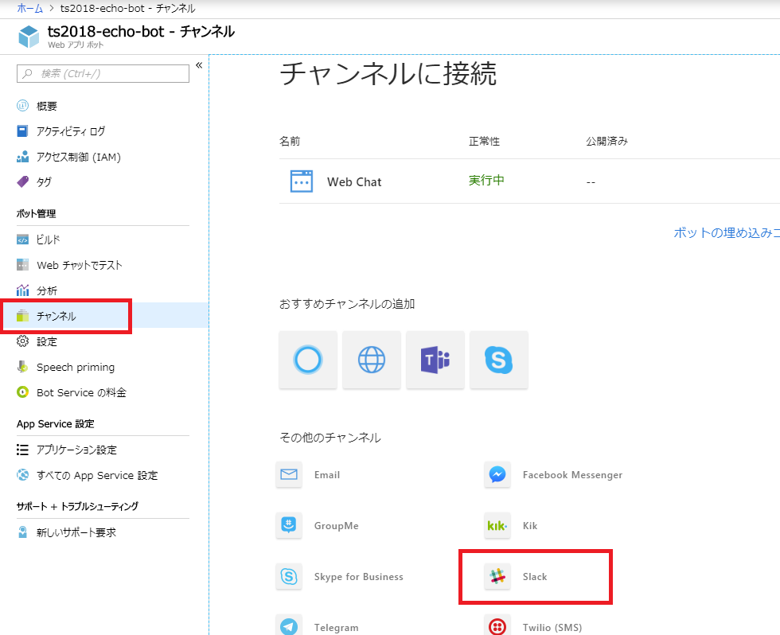
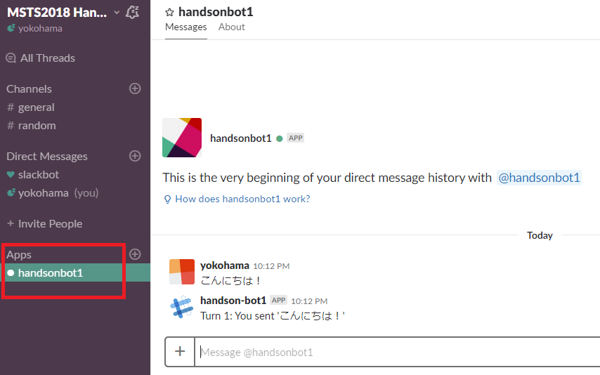
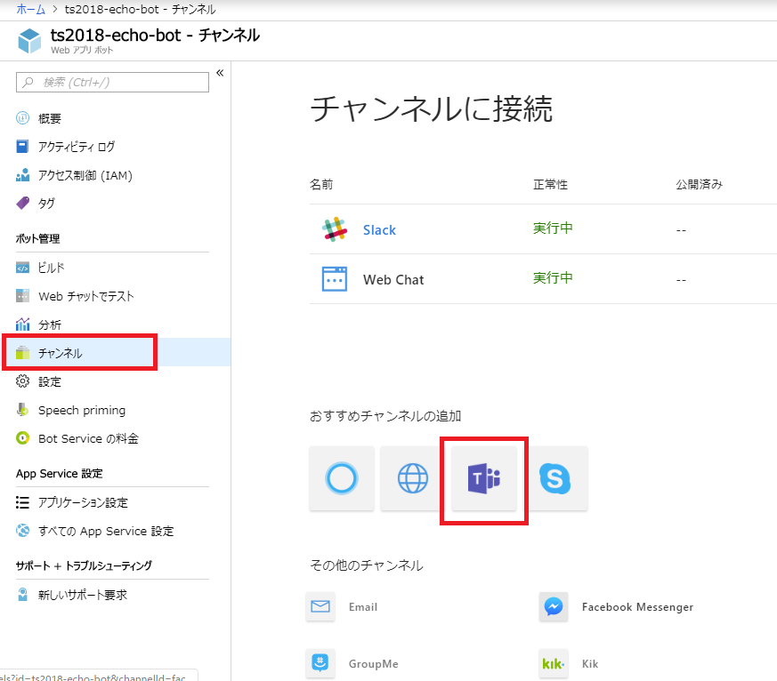

# 01-03. プログラムの変更とデプロイ

Azure 上にデプロイされた Bot Service (Web App Bot) のソースコードをダウンロードし、更新して再度デプロイしてみましょう。

## ソースコードのダウンロード

Azure ポータルで、今回作成したリソースグループを開き、種類が「Web アプリ ボット」のリソースをクリックし、Web App Bot を開きます。


&nbsp;

「ビルド」をクリック > 「zip ファイルをダウンロード」をクリックします。  
ソース Zip ファイルの作成中と表示され、準備が終わる（1 分程度かかります）と「zip ファイルをダウンロード」ボタンが表示されます。クリックしてダウンロードしましょう。


&nbsp;

ダウンロードされた Zip ファイルを解凍しましょう。

## ソースコードの編集

Zip ファイルを解凍すると、中にソリューションファイル（拡張子が `.sln` のファイル）があります。ダブルクリックすると、Visual Studio でプロジェクトが表示されます。

ソリューションエクスプローラーで「EchoWithCounterBot.cs」をダブルクリックして開きましょう。  
ここで詳細の説明はしませんが、ボットにアクセスすると、`EchoWithCounterBot` クラスの `OnTurnAsync` が呼ばれます。

## ウェルカムメッセージの実装

チャットボットに新たなユーザーが加わった場合、`turnContext.Activity.Type` が `conversationUpdate` という値でこのメソッドに入ってきます。  
新たなユーザーが加わった場合にウェルカムメッセージを入力してみましょう。

まず、`OnTurnAsync` メソッドを以下のように変更します。
（コメント「**// この else if 句を追加**」 `else if` ステートメントブロックのコードを追加しています。）

```cs
        public async Task OnTurnAsync(ITurnContext turnContext, CancellationToken cancellationToken = default(CancellationToken))
        {
            // Handle Message activity type, which is the main activity type for shown within a conversational interface
            // Message activities may contain text, speech, interactive cards, and binary or unknown attachments.
            // see https://aka.ms/about-bot-activity-message to learn more about the message and other activity types
            if (turnContext.Activity.Type == ActivityTypes.Message)
            {
                // Get the conversation state from the turn context.
                var state = await _accessors.CounterState.GetAsync(turnContext, () => new CounterState());

                // Bump the turn count for this conversation.
                state.TurnCount++;

                // Set the property using the accessor.
                await _accessors.CounterState.SetAsync(turnContext, state);

                // Save the new turn count into the conversation state.
                await _accessors.ConversationState.SaveChangesAsync(turnContext);

                // Echo back to the user whatever they typed.
                var responseMessage = $"Turn {state.TurnCount}: You sent '{turnContext.Activity.Text}'\n";
                await turnContext.SendActivityAsync(responseMessage);
            }
            else if (turnContext.Activity.Type == ActivityTypes.ConversationUpdate)　// この else if 句を追加
            {
                await SendWelcomeMessageAsync(turnContext, cancellationToken);　// この メソッドの実装は、この後します。
            }
            else
            {
                await turnContext.SendActivityAsync($"{turnContext.Activity.Type} event detected");
            }
        }
```

`OnTurnAsync` メソッドの後に、 以下のコードを実装します。

```cs
        private const string WelcomeText = "SampleBot へようこそ！";

        private static async Task SendWelcomeMessageAsync(ITurnContext turnContext, CancellationToken cancellationToken)
        {
            foreach (var member in turnContext.Activity.MembersAdded)
            {
                if (member.Id != turnContext.Activity.Recipient.Id)
                {
                    await turnContext.SendActivityAsync(WelcomeText, cancellationToken: cancellationToken);
                }
            }
        }
```

## ローカルでデバッグ

## 


## 発行（デプロイ）

今回のようにダウンロードしたプログラムには、既に Azure への発行情報が組み込まれていますが、発行をするためのパスワードを入力する必要があります。

### 発行プロファイルの取得

Web Apps（App Service）に対して発行を行う前に、Web Apps のリソースから発行プロファイルを取得し、パスワードを取得をします。

Azure のポータルを開きましょう。今回作成したリソースグループを開いて、種類が「App Service」のリソースをクリックします。



&nbsp;

メニューの「概要」 > 「発行プロファイルの取得」をクリックすると、発行プロファイルがダウンロードされます。


&nbsp;

発行プロファイルは、XML ファイルになっています。テキストエディター（メモ帳や VS Code）で開きましょう。  
改行がないため見難いですが、「publishProfile profileName="ts2018-echo-bot - Web Deploy"」の中の「userPWD」の値がパスワードになります。
この後の手順で利用します。



&nbsp;

### 発行（デプロイ）の実施

更新したプログラムを Azure 上にデプロイしてみましょう。

ここでは、Visual Studio の GUI から発行を行います。  
今回は説明しませんが、Azure CLI を使った発行や、継続的なデプロイの設定も可能です。

先ほどまで作業していた Visual Studio に戻り、ソリューションエクスプローラーでプロジェクト名を右クリック > 「発行」をクリックします。


&nbsp;

発行の画面が表示されます。「構成」をクリックします。


&nbsp;

発行のダイアログが表示されます。パスワードに先ほど取得したパスワードを入力しましょう。  
「接続の検証」ボタンをクリックすると、接続テストを行ってパスワードが正しいか確認できます。
正常に検証ができたら、「保存」ボタンをクリックしましょう。


&nbsp;

発行の画面に戻ったら、「発行」ボタンをクリックし、発行を行います。


&nbsp;

出力ウインドウで、発行の進捗が確認できます。以下のように表示されたら完了です。


&nbsp;

## WebChat で動作確認

Web Chat の機能で、更新したプログラムが正しく動作するか確認しましょう。  
Azure ポータルで、今回作成したリソースグループを開き、種類が「Web アプリ ボット」のリソースをクリックしましょう。



&nbsp;

「Web チャットでテスト」を開きます。文字を入力してウェルカムメッセージが表示されれば、正常に更新ができました。

> ウェルカムメッセージ表示のタイミングは、チャンネルによって多少異なります。


&nbsp;

## このチャプターのまとめ

ここまでで、以下のことができました。

- Azure 上にデプロイされたソースコードのダウンロード
- ソースコードの編集
- 編集したソースコードを GUI で発行（デプロイ）

ハンズオンはここまでとなります。次は、作成したリソースをクリーンアップします。

---

[前に戻る](./01-02_connect-to-channels.md) | [次へ進む](./01-04_cleanup.md)

---

### 参考ドキュメント

※ 2018 年 11 月現在だと、V4 の公式ドキュメントの一部は日本語翻訳対応が追い付いていないため、英語のドキュメントを見る必要があります。

- [Understanding how bots work](https://docs.microsoft.com/en-us/azure/bot-service/bot-builder-basics?view=azure-bot-service-4.0&tabs=cs)
- [Download and redeploy bot code](https://docs.microsoft.com/en-us/azure/bot-service/bot-service-build-download-source-code?view=azure-bot-service-4.0)
- [Set up continuous deployment](https://docs.microsoft.com/en-us/azure/bot-service/bot-service-build-continuous-deployment?view=azure-bot-service-4.0)
