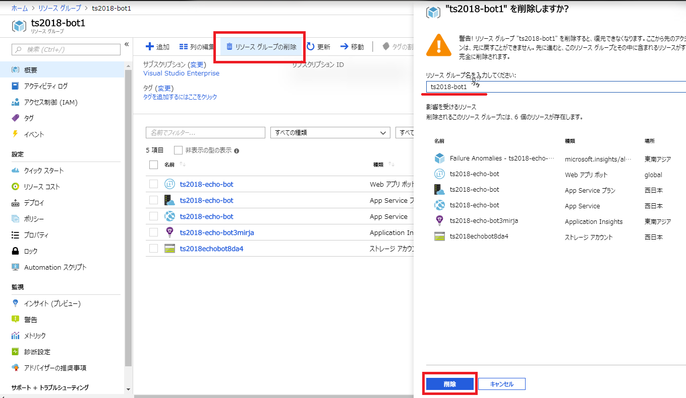

# リソースグループを削除する

今回作成したリソースを削除しましょう。

Azure では、リソースグループを削除することでその中のリソースを一括して削除できます。  
Azure ポータルで、作成したリソースグループを開き、画面上部の「リソースグループの削除」をクリックします。  
削除のブレードが表示されます。リソースグループ名を入力し、「削除」ボタンをクリックし、リソースの削除を行います。

次に進み、本ハンズオンのまとめをします。

---

[Back](01-03_edit-program.md) | [Next](01-05_wrapup.md)
