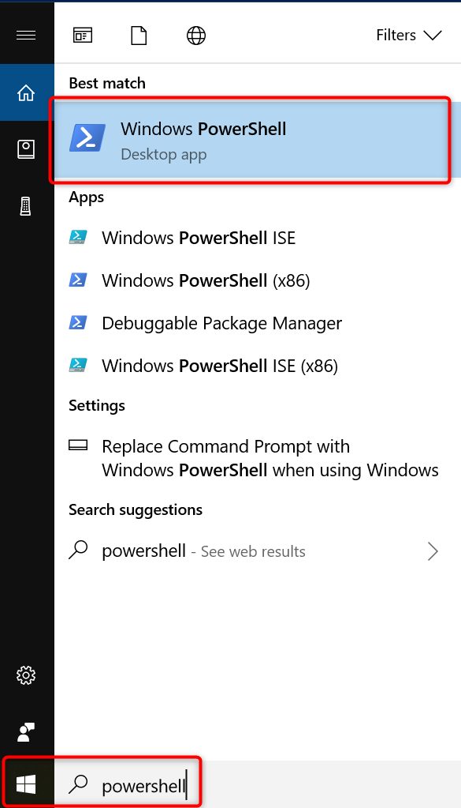
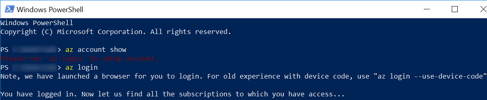
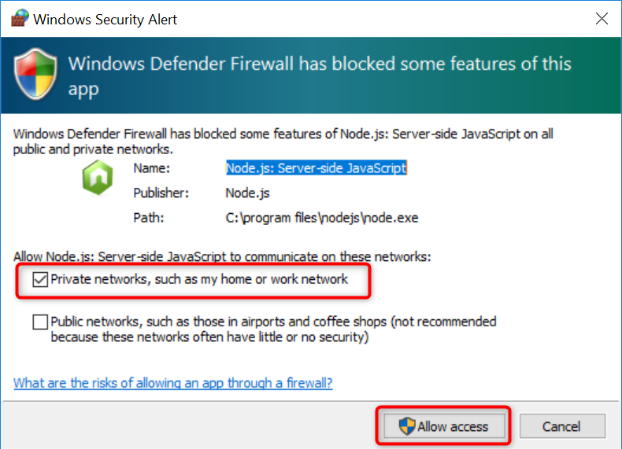
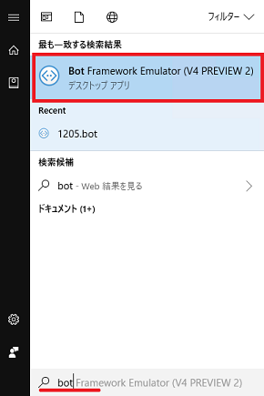
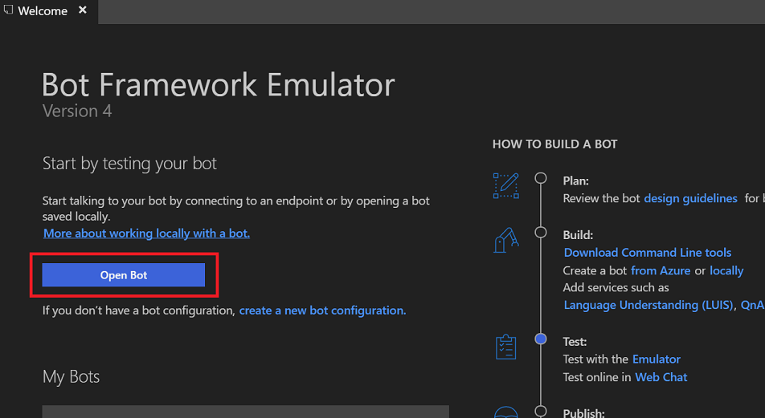
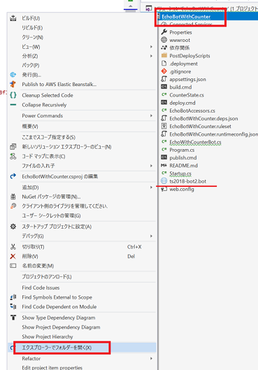
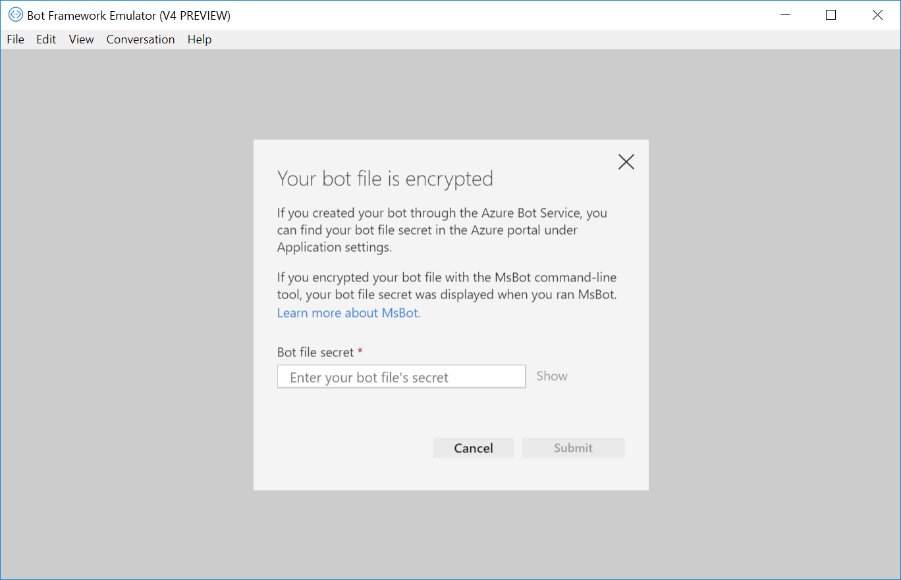
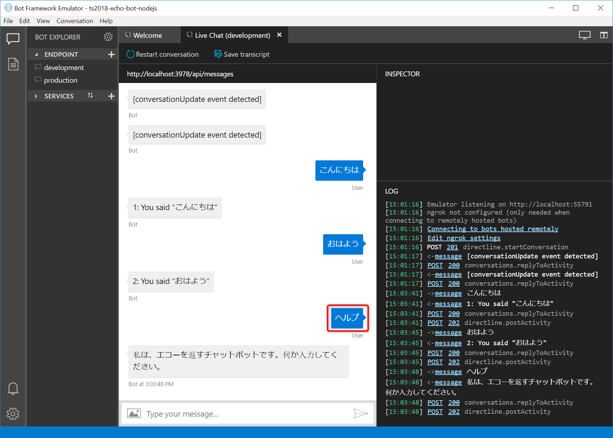
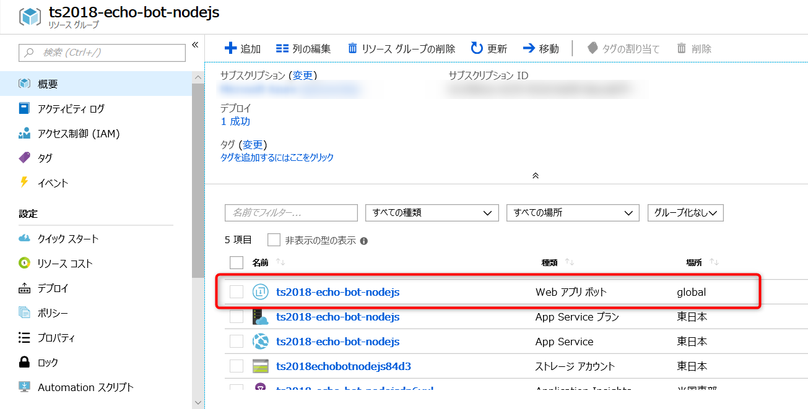
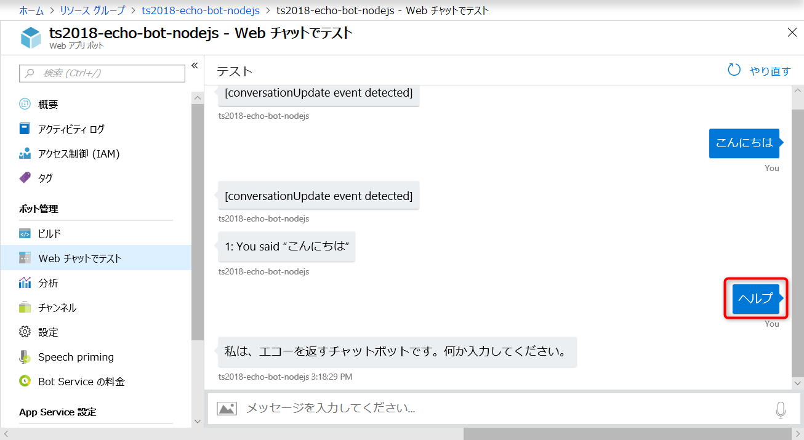

# 01-02. プログラムの変更とデプロイ

Azure 上にデプロイされた Bot Service (Web App Bot) のソースコードをダウンロードし、更新して再度デプロイしてみましょう。

Node.js (javascript) 版では、Windows/MacOS/Linux のクロスプラットフォームで動作する Azure CLI と Visual Studio Code を利用します。参考情報については章末をご覧ください。

## Azure CLI の準備

Windows のスタートメニューの検索欄で、「powershell」と入力し、 Windows PowerShell を開きます。



&nbsp;

下記のコマンドを実行し、ログイン済みか確認します。

```powershell
# ログイン中のアカウント（サブスクリプションを含む）を表示する
az account show
```

下記のようにJSON形式でサブスクリプション情報が表示されれば、ログイン済みですので、次の項へお進みください。
```json
{
  "cloudName": "AzureCloud",
  "id": "<subscription id>",
  "isDefault": false,
  "name": "<subscription name>",
  "state": "Enabled",
  "tenantId": "<tenant id>",
  "user": {
    "name": "<user name>",
    "type": "user"
  }
}
```

&nbsp;

もし、 `Please run 'az login' to setup account.` という文言が表示される場合は、ログインが必要なので、下記コマンドを実行します。すると、ブラウザが開きログインを促されるので、画面に従いログインします。

```powershell
# Azure にログインする
az login
```

下記の表示のあと、しばらく待つとサブスクリプション情報が表示され、ログインが完了します。



&nbsp;

ここでサブスクリプションが複数表示される場合は、利用するサブスクリプションを指定してください。

```powershell
# 利用可能なサブスクリプションの一覧を表示する
az account list

[
  {
    "cloudName": "AzureCloud",
    "id": "<subscription id>",
    "isDefault": false,
    "name": "<subscription name>",
    "state": "Enabled",
    "tenantId": "<tenant id>",
    "user": {
      "name": "<user name>",
      "type": "user"
    }
  },
  {
    "cloudName": "AzureCloud",
    "id": "<subscription id>",
    "isDefault": false,
    "name": "<subscription name>",
    "state": "Enabled",
    "tenantId": "<tenant id>",
    "user": {
      "name": "<user name>",
      "type": "user"
    }
  }
]

# 利用するサブスクリプションの subscription id をコピーし、下記コマンドで指定する
az account set -s <subscription id>

# 指定したサブスクリプションが指定されたかどうか、確認する
az account show
```

&nbsp;

## リソースグループ名と Bot Service 名を確認

まず、対象のリソースグループ名と Bot Service 名前を確認しましょう。

下記コマンドを実行し、リソースグループ名を確認し、変数に設定します。 `az`コマンドは、 `--output table` というオプションを利用すると、テーブル形式で表示できます。

```powershell
# リソースグループ一覧を表示する
az group list --output table

Name                        Location    Status
--------------------------  ----------  ---------
ts2018-echo-bot-nodejs      japaneast   Succeeded

# リソースグループ名を変数に設定する
Set-Variable -Name RESOURCE_GROUP -Value ts2018-echo-bot-nodejs

# 正しく変数に設定されたか確認する（指定したリソースグループ名が表示されればOKです。）
$RESOURCE_GROUP
```

&nbsp;

次に、下記コマンドを実行し、Bot Service の名前を確認し、変数に設定します。 Bot Service は、 _Type_ が `Microsoft.BotService/botServices` となっているリソースです。

```powershell
# リソースグループ内のリソース一覧を表示する
az resource list -g $RESOURCE_GROUP --output table

Name                          ResourceGroup           Location    Type                               Status
----------------------------  ----------------------  ----------  ---------------------------------  --------
ts2018-echo-bot-nodejs        ts2018-echo-bot-nodejs  global      Microsoft.BotService/botServices
ts2018-echo-bot-nodejsdp6vul  ts2018-echo-bot-nodejs  eastus      microsoft.insights/components
ts2018echobotnodejs84d3       ts2018-echo-bot-nodejs  japaneast   Microsoft.Storage/storageAccounts
ts2018-echo-bot-nodejs        ts2018-echo-bot-nodejs  japaneast   Microsoft.Web/serverFarms
ts2018-echo-bot-nodejs        ts2018-echo-bot-nodejs  japaneast   Microsoft.Web/sites

# Bot Service 名を変数に設定する
Set-Variable -Name BOTSERVICE_NAME -Value ts2018-echo-bot-nodejs

# 正しく変数に設定されたか確認する（指定した Bot Service 名が表示されればOKです。）
$BOTSERVICE_NAME
```

&nbsp;

## ソースコードのダウンロード

それでは、ソースコードをダウンロードしましょう。

&nbsp;

まず、2018年11月時点、Azure CLI のバージョンが `2.0.49` までの場合は、 `botservice` の拡張機能を追加する必要があります。PowerShell で、下記のコマンドを実行してください。

なお、 `The extension botservice already exists.` と表示される場合はすでに追加済みのため、次に進んで問題ありません。

```powershell
# botserviceの拡張機能を追加する
az extension add --name botservice
```

&nbsp;

つぎに、任意のディレクトリを作成し、その中に Bot Service のソースコード一式をダウンロードします。

```powershell
# 任意のディレクトリを作成し、そのディレクトリに移動する
mkdir handson-source
cd handson-source

# Bot Service からソースコード一式をダウンロードし、そのディレクトリに移動する
az bot download --resource-group $RESOURCE_GROUP --name $BOTSERVICE_NAME
cd $BOTSERVICE_NAME
```

&nbsp;

## ソースコードの編集

ソースコード一式のディレクトリを Visual Studio Code で開きます。PowerShell から Visual Studio Code を起動するには、下記のコマンドを実行してください。

```bash
# カレントディレクトリを、 Visual Studio Code で開く
code .
```

&nbsp;

### 簡単な分岐の実装

ユーザーが特定のことばを入力した場合、チャットボットが特定のメッセージを返す動作を作ってみましょう。

ここでは、「**ヘルプ**」と入力すると、「**私は、エコーを返すチャットボットです。何か入力してください。**」と返すようにします。

&nbsp;

ソースコード一式のディレクトリを開いた Visual Studio Code で、 _bot.js_ を開きます。このファイルには `EchoBot` クラスが記述されており、 28行目付近の `onTurn()` でユーザーからの入力に対する処理を記述しています。この部分を変更しましょう。

下記の変更前後のサンプルを参考に、「 `★: ここから ----`」から「`★: ここまで ----`」までを書き換えてください。

#### _bot.js_ (変更前)
```js
    async onTurn(turnContext) {

        // ...省略...

        if (turnContext.activity.type === ActivityTypes.Message) {
            // read from state.
            let count = await this.countProperty.get(turnContext);
            count = count === undefined ? 1 : ++count;
            await turnContext.sendActivity(`${ count }: You said "${ turnContext.activity.text }"`);
            // increment and set turn counter.
            await this.countProperty.set(turnContext, count);
        } else { 
            // Generic handler for all other activity types.
            await turnContext.sendActivity(`[${ turnContext.activity.type } event detected]`);
        }
        // Save state changes
        await this.conversationState.saveChanges(turnContext);
    }
```

#### _bot.js_ (変更後)
```js
    async onTurn(turnContext) {

        // ...省略...

        if (turnContext.activity.type === ActivityTypes.Message) {
            // ★: ここから ----
            // ★: 「ヘルプ」と入力された場合の条件を追加する
            if (turnContext.activity.text == "ヘルプ")
            {
                // ★: ヘルプ用のテキストを送信する
                const helpMessage = "私は、エコーを返すチャットボットです。何か入力してください。";
                await turnContext.sendActivity(helpMessage);
            }
            // ★: その他の条件の場合、元の処理を実行する
            else {
                // read from state.
                let count = await this.countProperty.get(turnContext);
                count = count === undefined ? 1 : ++count;
                await turnContext.sendActivity(`${ count }: You said "${ turnContext.activity.text }"`);
                // increment and set turn counter.
                await this.countProperty.set(turnContext, count);
            }
            // ★: ここまで ----
        } else {
            // Generic handler for all other activity types.
            await turnContext.sendActivity(`[${ turnContext.activity.type } event detected]`);
        }
        // Save state changes
        await this.conversationState.saveChanges(turnContext);
    }
```

&nbsp;

## ローカルでデバッグ

本ハンズオンでは、PC に、ローカルでデバッグ実行してテストできるよう、チャットボットのクライアントアプリ（ユーザーがことばを入力する UI のアプリ)として、Bot Framework Emulator がインストール済みになっています。
ソースコードをデバッグし、Bot Framework Emulator から起動して動作確認してみましょう。

&nbsp;

### チャットボットの実行

まず、チャットボットを実行します。PowerShell に戻り、下記コマンドを実行してください。

```powershell
# パッケージをインストールする（※1 下記参照）
npm install

# 実行する（※2 下記参照）
npm start
```

- ※1 `npm install` を実行すると、 `node-gyp` のリビルドでエラーが表示される場合がありますが、本ハンズオンには影響しませんので無視してお進みください。
- ※2 `npm start` を実行すると、初回のみ下記の警告が表示されることがあります。「プライベートネットワーク（ホームネットワークや社内ネットワークなど）」（ _Private networks, such as my home or work network_ ）にチェックをし、「アクセスを許可する」（ _Allow access_ ）ボタンをクリックして進めてください。
  - 

&nbsp;

### エミュレーターの起動

Windows のメニューで「bot」と入力し、Bot Framework Emulator を起動します。



&nbsp;

「Open Bot」をクリックし、`.bot` ファイルを選択しましょう。



&nbsp;

`.bot` ファイルの場所が不明の場合は、Visual Studio でプロジェクト名を右クリックし、「エクスプローラーでフォルダーを開く」をクリックして確認することができます。



&nbsp;

下記のように _Bot file secret_ を求められた場合は、ソースコード一式の _.env_ の _botFileSecret_ の値を入力し、「Submit」ボタンをクリックして進んでください。



#### _.env_
```json
botFileSecret=<bot file secret>
botFilePath=ts2018-echo-bot-nodejs.bot
NODE_ENV=development
```

&nbsp;

### 動作確認

チャットウィンドウが開かれたら、「ヘルプ」と入力し、実装した動作になることを確認してみましょう。



&nbsp;

### チャットボットの終了

確認が完了したら、チャットボットを終了しておきましょう。 PowerShell で下記コマンドを実行してください。

```powershell

# Ctrl + c を入力する

# 下記の確認が表示されるので、「Y」を入力してチャットボットを終了する
Terminate batch job (Y/N)? Y
```

&nbsp;

### デプロイの実施

更新したプログラムを Azure 上にデプロイしてみましょう。

ここでは、 Azure CLI を利用してデプロイを行います。これ以外にも、継続的なデプロイの設定なども可能です。

&nbsp;

PowerShell で下記コマンドを実行し、編集したソースコードを Azure 上の Bot Service にデプロイします。

```powershell
# カレントディレクトリのコードを Bot Service にデプロイする
az bot publish --resource-group $RESOURCE_GROUP --name $BOTSERVICE_NAME
```

しばらく待ち、下記のように表示されたら完了です。

```json
{
  "active": true,
  "author": "N/A",
  "author_email": "N/A",
  "complete": true,
  "deployer": "Push-Deployer",
  "end_time": "2018-10-29T02:00:34.9846069Z",
  "id": "<id>",
  "is_readonly": true,
  "is_temp": false,
  "last_success_end_time": "2018-10-29T02:00:34.9846069Z",
  "log_url": "https://ts2018-echo-bot-nodejs.scm.azurewebsites.net/api/deployments/latest/log",
  "message": "Created via a push deployment",
  "progress": "",
  "provisioningState": null,
  "received_time": "2018-10-29T02:00:04.2864321Z",
  "site_name": "ts2018-echo-bot-nodejs",
  "start_time": "2018-10-29T02:00:04.3957801Z",
  "status": 4,
  "status_text": "",
  "url": "https://ts2018-echo-bot-nodejs.scm.azurewebsites.net/api/deployments/latest"
}
```

&nbsp;

## WebChat で動作確認

Web Chat の機能で、更新したプログラムが正しく動作するか確認しましょう。
Azure ポータルで、Bot Service のリソースを開きましょう。

> 開き方が不明の場合: 今回作成したリソースグループを開き、種類が「Web アプリ ボット」のリソースをクリックして開きます。



&nbsp;

「Web チャットでテスト」を開きます。「ヘルプ」と入力すると、実装した内容が返されることを確認できます。



&nbsp;

## このチャプターのまとめ

ここまでで、以下のことができました。

- Azure 上にデプロイされたソースコードのダウンロード
- ソースコードの編集
- 編集したソースコードをデプロイ

次は、Slack や Microsoft Teams といったチャンネルに接続してみます。

---

[前に戻る](./01-01_create-webapp-bot.md) | [次へ進む](./01-03_connect-to-channels.md)

---

### 参考ドキュメント

#### Bot Framework
※ 2018 年 11 月現在だと、V4 の公式ドキュメントの一部は日本語翻訳対応が追い付いていないため、英語のドキュメントを見る必要があります。

- [Understanding how bots work](https://docs.microsoft.com/en-us/azure/bot-service/bot-builder-basics?view=azure-bot-service-4.0)
- [botbuilder-tools/AzureCli at master · Microsoft/botbuilder-tools](https://github.com/Microsoft/botbuilder-tools/tree/master/AzureCli)
- [Download and redeploy bot source code - Bot Service | Microsoft Docs](https://docs.microsoft.com/en-us/azure/bot-service/bot-service-build-download-source-code?view=azure-bot-service-4.0)
- [Create a bot using Bot Builder SDK for JavaScript - Bot Service | Microsoft Docs](https://docs.microsoft.com/en-us/azure/bot-service/javascript/bot-builder-javascript-quickstart?view=azure-bot-service-4.0)
- [Set up continuous deployment](https://docs.microsoft.com/en-us/azure/bot-service/bot-service-build-continuous-deployment?view=azure-bot-service-4.0)


#### Azure CLI

- [Azure CLI の概要 | Microsoft Docs](https://docs.microsoft.com/ja-jp/cli/azure/?view=azure-cli-latest)

#### Visual Studio Code

- [Visual Studio Code - Code Editing. Redefined](https://code.visualstudio.com/)
